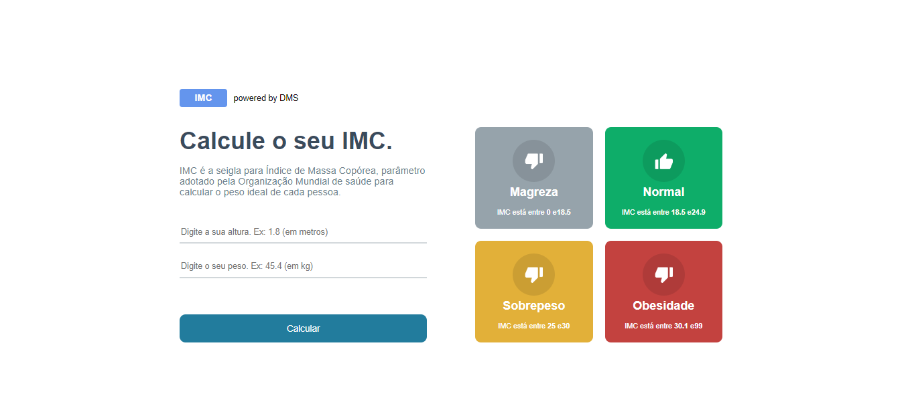

# Calculadora de IMC

Projeto em React + Typescript fazendo uma calculadora de IMC

Projeto desenvolvido durante o curso [B7Web](https://b7web.com.br)
 

      
 

## GitPage: https://douglasmonteirodev.github.io/calc-imc-ts/build

## Instalação

-   `npm install`

### Para rodar

-   `npm start`

# react-calc-imc
